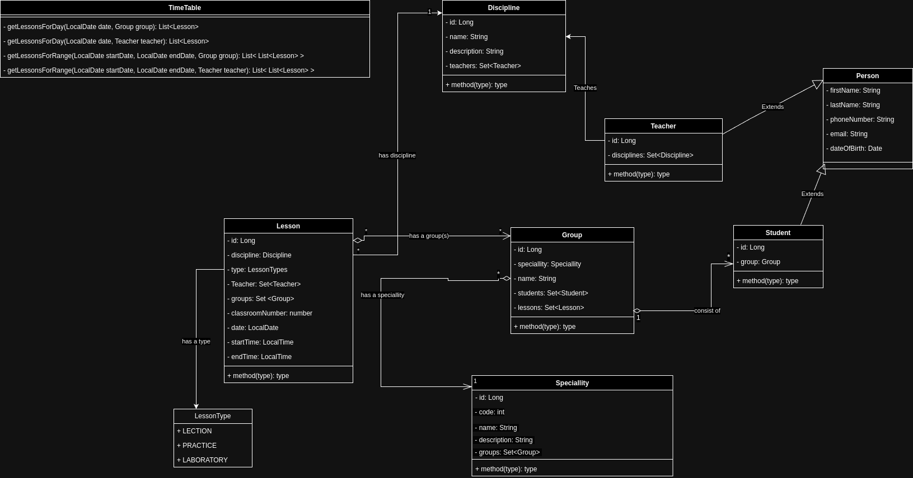

# university-cms

## Name
University cms

## Description
This app created for manage university scedule. 
There are a few user types: Teacher and Student.
Teacher has disciplines which he are able to teach. Also teacher have lessons.
Student includes in group. Student also has lessons.

Uml diagram:

## Main flows

Given user is logged on as **Student**:

- User can see and navigate to `My Schedule` menu
- In tab My scedule user can view schedule for 1 day and for a month.
- User can select up to 31 days to be displayed in a grid
- User can click on one of displayed days to see day in details (in more convinient format)
- User can switches between monthes using paggination

Given user is logged on as **Teacher**:

- User can see and navigate to `My Schedule` menu
- User should see own Teacher schedule according with selected date/range filter

Given user is logged on as **Admin**:

- User can create and edit _Students_ and _Teachers_
- User can add assign disciplines to Teacher
- User can create groups
- User can add _Student_ to _Group_
- User can create lessons and assign it to _Students_ and _Teacher_
